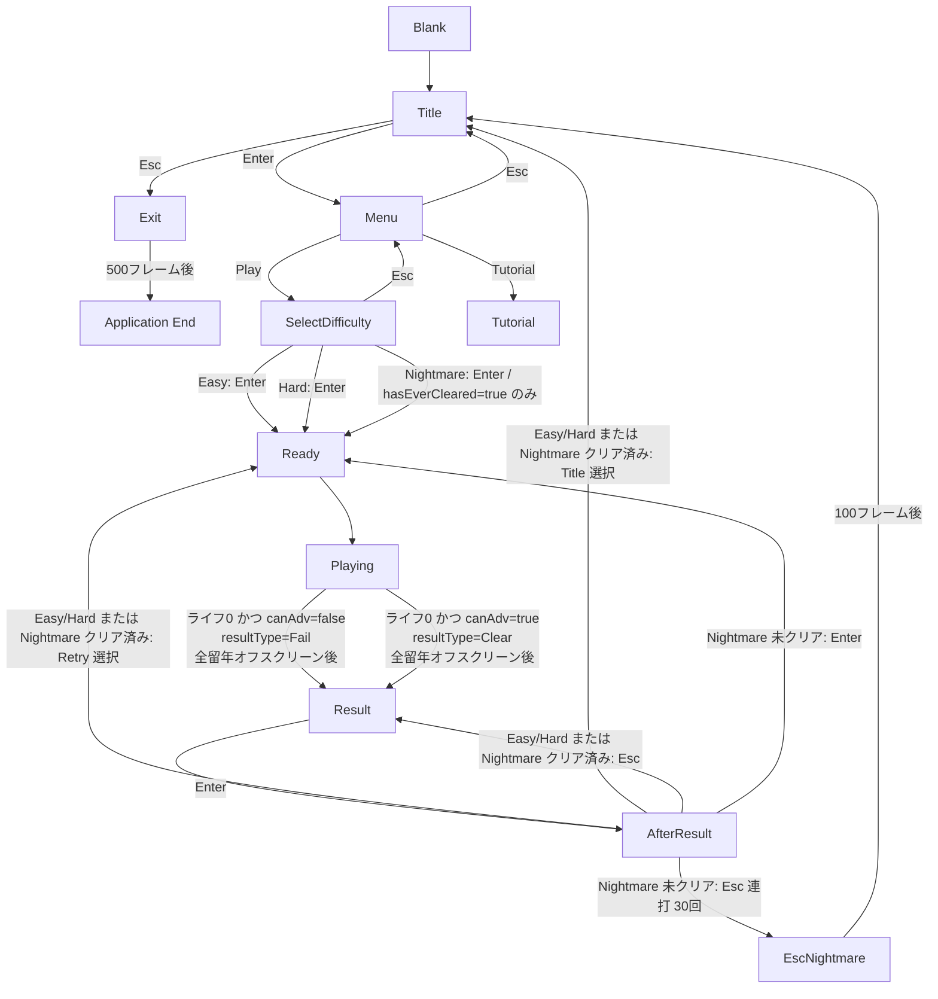
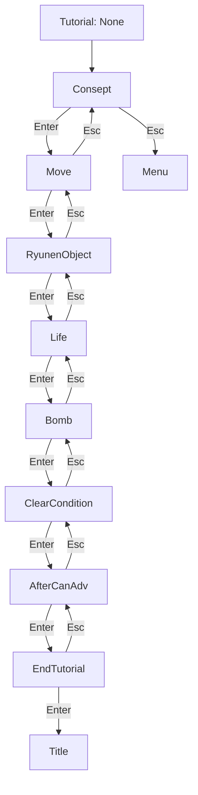

# FAIL THE YEAR - ゲームフロー（フローチャート版）

> 現行実装（`SceneManager` / 各 `*SceneState`）に基づく遷移を、Mermaid フローチャートで可視化したドキュメントです。

## メイン遷移

## チュートリアル遷移

## 補足
- `SceneId::Clear`・`SceneId::Fail` は列挙体に存在するが、シーンとしての直接遷移は行われない。プレイ中の結果確定は `GameResult` 型で管理され、全留年オフスクリーン後に `Result` シーンへ遷移する。
- `SceneId::Ending` は列挙体に存在するが、現行遷移では未使用。
- `Exit` シーンはタイトルの Esc で呼び出され、ゲーム進行状況に応じたテキストを 100 フレーム表示した後にウィンドウを閉じる（即時終了ではない）。
